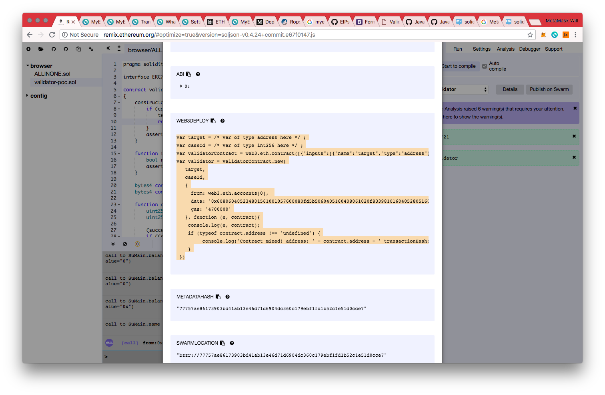

# Testing deployed smart contract with estimate gas technique 
This repo contains code examples for article written about estimate gas testing technique.

## How to do it

Compile code in remix.

Then edit the code in the html file.

Done.

Also this works WITH TOUCHING blockchain. You can run it server side and it scales.

